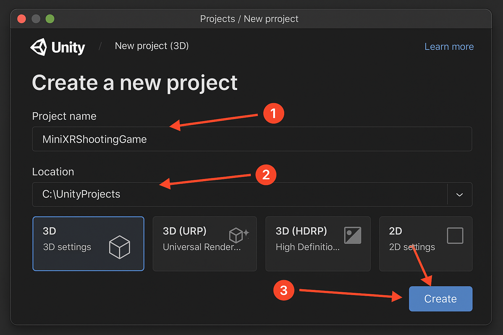
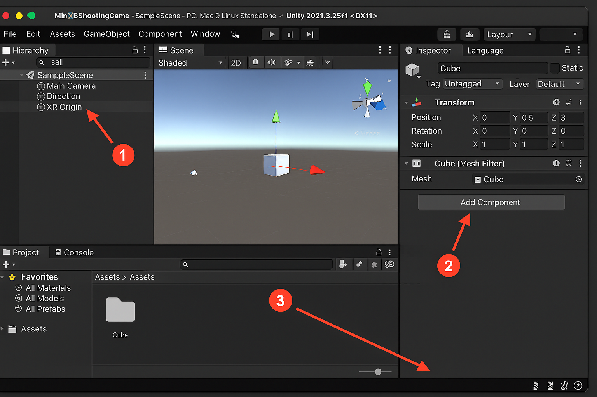
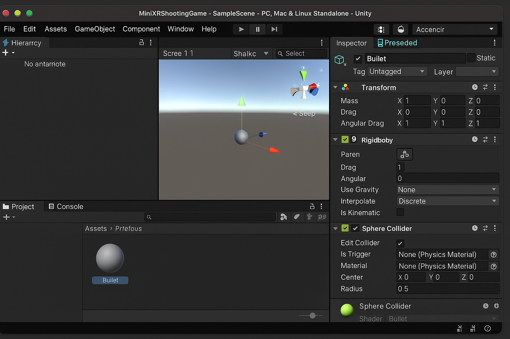
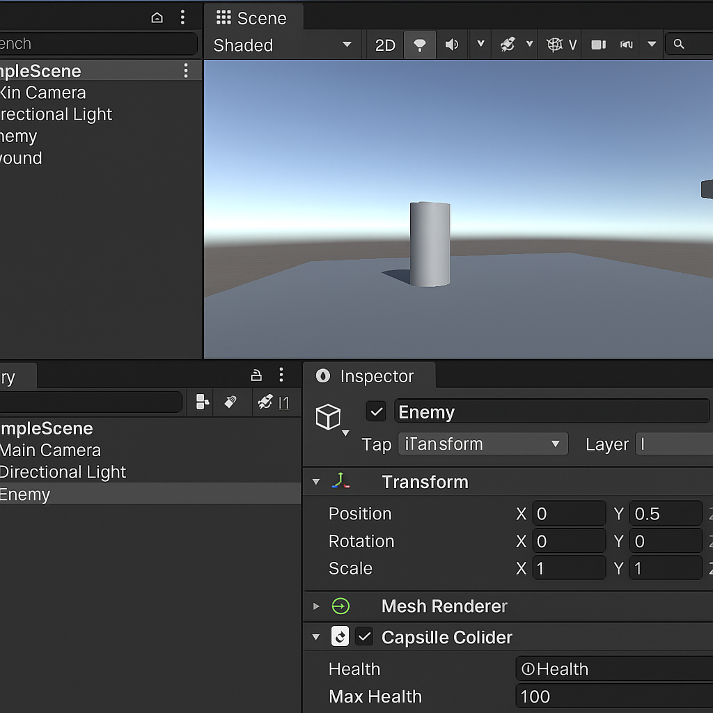

# Chapter 5:  C# Basics for Game Development


## 5.1 Introduction to C#

C# (pronounced "C Sharp") is a modern, object-oriented programming language developed by Microsoft. In Unity, C# is the main scripting language for controlling game logic, gameplay mechanics, player interactions, and more.

**Why C# for Games?**

* Powerful and versatile
* Strongly typed (helps avoid bugs)
* Fully integrated with Unity
* Supports OOP principles that are perfect for complex games


### 5.1.1 Variables and Data Types

Variables are named storage locations for data.

**Example:**

```csharp
int playerHealth = 100;     // Integer
float moveSpeed = 5.5f;     // Floating point number
string playerName = "Alex"; // Text
bool isAlive = true;        // Boolean
```

**Note:** In Unity, you often make variables **public** so they can be changed in the Inspector:

```csharp
public float jumpForce = 10f;
```


### 5.1.2 Methods (Functions)

Methods contain reusable blocks of code.

```csharp
void StartGame()
{
    Debug.Log("Game has started!");
}

int AddScore(int currentScore, int points)
{
    return currentScore + points;
}
```

**Key Points:**

* **void** means no value is returned
* You can pass parameters and return values


### 5.1.3 Control Structures

**Conditional Statements**

```csharp
if (playerHealth <= 0)
{
    Debug.Log("Game Over!");
}
else
{
    Debug.Log("Keep playing!");
}
```

**Loops**

```csharp
for (int i = 0; i < 5; i++)
{
    Debug.Log("Level: " + i);
}
```


### 5.1.4 Object-Oriented Programming (OOP)

OOP is central to game development because games involve many **objects**—players, enemies, weapons, power-ups—each with their own data and behaviors.

**The Four Pillars of OOP**

1. **Encapsulation** – Bundling data and methods in a single unit (class)
2. **Abstraction** – Hiding complex details and exposing only essentials
3. **Inheritance** – Creating new classes from existing ones
4. **Polymorphism** – Using a single interface to represent different forms


#### Classes and Objects

A **class** is a blueprint; an **object** is an instance of a class.

```csharp
public class Player
{
    public string name;
    public int health;

    public void Attack()
    {
        Debug.Log(name + " attacks!");
    }
}
```

**Creating an Object in Unity:**

```csharp
Player hero = new Player();
hero.name = "Knight";
hero.health = 100;
hero.Attack();
```


#### Encapsulation

Using **private** variables to protect data and **public methods** to control access.

```csharp
public class Player
{
    private int health = 100;

    public int GetHealth()
    {
        return health;
    }

    public void TakeDamage(int damage)
    {
        health -= damage;
        if (health <= 0)
        {
            Debug.Log("Player is dead!");
        }
    }
}
```


#### Inheritance

Allows creating specialized classes from a base class.

```csharp
public class Character
{
    public string name;
    public void Move()
    {
        Debug.Log(name + " is moving.");
    }
}

public class Enemy : Character
{
    public void Attack()
    {
        Debug.Log(name + " attacks the player!");
    }
}
```

**Usage:**

```csharp
Enemy goblin = new Enemy();
goblin.name = "Goblin";
goblin.Move();
goblin.Attack();
```

---

#### Polymorphism

Using overridden methods to give different behaviors for the same action.

```csharp
public class Character
{
    public virtual void Speak()
    {
        Debug.Log("Character speaks.");
    }
}

public class NPC : Character
{
    public override void Speak()
    {
        Debug.Log("Hello, traveler!");
    }
}

public class Enemy : Character
{
    public override void Speak()
    {
        Debug.Log("You shall not pass!");
    }
}
```

**Usage:**

```csharp
Character npc = new NPC();
npc.Speak(); // Hello, traveler!

Character enemy = new Enemy();
enemy.Speak(); // You shall not pass!
```

---

### Constructors

Special methods called when an object is created.

```csharp
public class Weapon
{
    public string name;
    public int damage;

    public Weapon(string weaponName, int weaponDamage)
    {
        name = weaponName;
        damage = weaponDamage;
    }
}
```

**Usage:**

```csharp
Weapon sword = new Weapon("Excalibur", 50);
Debug.Log(sword.name); // Excalibur
```


### 5.1.5 Why OOP is Perfect for Game Development

* Players, enemies, and items can all be classes
* Inheritance lets you reuse code for similar game entities
* Polymorphism enables flexible AI and gameplay mechanics
* Encapsulation ensures that game state is not corrupted accidentally


## 5.2 C# in Unity Game


### 5.2.1 Unity Scripting Basics

In Unity, C# scripts are components that you attach to **GameObjects** in your scene. These scripts control behaviors such as player movement, enemy AI, UI interactions, and more.


#### MonoBehaviour: The Base Class for Unity Scripts

Most Unity scripts inherit from `MonoBehaviour`. This base class provides special methods that Unity calls automatically during the game loop:

| Method               | When it Runs                             | Purpose                                 |
| -------------------- | ---------------------------------------- | --------------------------------------- |
| `Start()`            | Once, before the first frame update      | Initialization                          |
| `Update()`           | Every frame                              | Game logic that runs continuously       |
| `FixedUpdate()`      | Regular physics updates (fixed timestep) | Physics and movement calculations       |
| `OnCollisionEnter()` | When a collision begins                  | Detecting collisions with other objects |


**Example: Simple Player Movement Script**

```csharp
using UnityEngine;

public class PlayerController : MonoBehaviour
{
    public float speed = 5f;

    void Update()
    {
        float horizontal = Input.GetAxis("Horizontal"); // A/D or Left/Right arrows
        float vertical = Input.GetAxis("Vertical");     // W/S or Up/Down arrows

        Vector3 movement = new Vector3(horizontal, 0f, vertical);
        transform.Translate(movement * speed * Time.deltaTime);
    }
}
```

* **`Input.GetAxis`** reads player input from keyboard or controller.
* **`transform.Translate`** moves the player GameObject.


### 5.2.2 Working with Components and GameObjects

Unity’s architecture is based on GameObjects and Components.

* A **GameObject** is a container or entity in the scene.
* **Components** (like scripts, colliders, renderers) add behavior or data to GameObjects.

You can access and manipulate components from your script:

```csharp
public class PlayerHealth : MonoBehaviour
{
    private int health = 100;

    void Start()
    {
        Debug.Log("Player health: " + health);
    }

    public void TakeDamage(int damage)
    {
        health -= damage;
        if (health <= 0)
        {
            Debug.Log("Player died");
            // Handle death logic here
        }
    }
}
```


### 5.2.3 Detecting Collisions

To detect physical interactions, your GameObjects need **colliders** and optionally **rigidbodies**.

**Example:**

```csharp
void OnCollisionEnter(Collision collision)
{
    if (collision.gameObject.CompareTag("Enemy"))
    {
        Debug.Log("Collided with Enemy!");
    }
}
```

* Make sure your enemy GameObjects are tagged with `"Enemy"`.
* Unity calls `OnCollisionEnter` automatically on collision.


### 5.2.4 Instantiating Objects (Spawning)

To create objects at runtime (bullets, enemies), use `Instantiate()`.

```csharp
public GameObject bulletPrefab;
public Transform firePoint;

void Update()
{
    if (Input.GetButtonDown("Fire1"))  // Left mouse button or VR trigger
    {
        Instantiate(bulletPrefab, firePoint.position, firePoint.rotation);
    }
}
```

* `bulletPrefab` is a prefab dragged into the Inspector.
* `firePoint` is an empty GameObject representing the shooting position.


### 5.2.5 Using Coroutines

Coroutines let you write timed actions without blocking the main thread.

Example: Spawn enemies every few seconds.

```csharp
IEnumerator SpawnEnemies()
{
    while(true)
    {
        Instantiate(enemyPrefab, spawnPoint.position, Quaternion.identity);
        yield return new WaitForSeconds(3f);  // Wait 3 seconds
    }
}

void Start()
{
    StartCoroutine(SpawnEnemies());
}
```


### 5.2.6 Accessing Other GameObjects and Scripts

Sometimes you need to access another object’s script:

```csharp
public class Player : MonoBehaviour
{
    public Enemy enemy;

    void Start()
    {
        enemy = GameObject.Find("Enemy1").GetComponent<Enemy>();
    }

    void Update()
    {
        if(enemy != null)
        {
            enemy.TakeDamage(10);
        }
    }
}
```


### 5.2.7 Managing UI from Scripts

Updating score, health bars, or messages is essential.

Example: Update a UI text element with score.

```csharp
using UnityEngine.UI;

public class ScoreManager : MonoBehaviour
{
    public Text scoreText;
    private int score = 0;

    public void AddScore(int points)
    {
        score += points;
        scoreText.text = "Score: " + score;
    }
}
```

* Drag the UI Text element into the `scoreText` field in Inspector.


### 5.2.8 Organizing Scripts with OOP in Unity

You can use OOP principles to keep scripts modular and reusable.

Example: Base class for all enemies:

```csharp
public class Enemy : MonoBehaviour
{
    public int health = 50;

    public virtual void TakeDamage(int damage)
    {
        health -= damage;
        if (health <= 0) Die();
    }

    protected virtual void Die()
    {
        Destroy(gameObject);
    }
}

public class Goblin : Enemy
{
    public override void Die()
    {
        Debug.Log("Goblin died!");
        base.Die();
    }
}
```


### 5.2.9 Debugging Tips

* Use `Debug.Log()` to print variables or messages to the Console.
* Use **breakpoints** and the Visual Studio debugger for step-by-step code inspection.
* Check Unity's Console for errors and warnings frequently.


### 5.2.10 Summary

* Unity scripts derive from `MonoBehaviour` and run inside Unity’s game loop.
* `Update()` is called every frame; `Start()` runs once at the beginning.
* You can control GameObjects through their Transform and Components.
* Use collisions, instantiation, and coroutines for dynamic gameplay.
* OOP concepts help organize Unity scripts, making them scalable and maintainable.


## 5.3 Unity Game Project: Mini XR Shooting Game


### 5.3.1 Project Setup


<figure class="image">
   
   <figcaption>Project Creation in Unity</figcaption> 
</figure>


**Step 1: Create a New Unity Project**

* Open Unity Hub
* Select **3D Template (preferably URP for better graphics)**
* Name your project: **MiniXRShootingGame**
* Click **Create**

**Step 2: Import XR Interaction Toolkit**

* Window → Package Manager
* Search **XR Interaction Toolkit**
* Install the latest stable version

**Step 3: Setup XR Plug-in Management**

* Edit → Project Settings → XR Plug-in Management
* Enable your target platform (e.g., **OpenXR** for most VR devices)
* Follow prompts to finish setup


### 5.3.2 Scene Setup

#### Create Basic Scene Elements:

* **Ground:** Right-click Hierarchy → 3D Object → Plane → Rename to “Ground”
* **Player:** Add an **XR Origin (Action-Based)** prefab from the XR Interaction Toolkit → Rename to “Player”
* **Enemy prefab:**

  * Create a Cube → Rename to “Enemy”
  * Add **Rigidbody** (enable gravity) and **Box Collider** components
  * Tag it as “Enemy”
  * Make it a prefab by dragging it into the Project window

<figure class="image">
   
   <figcaption>Unity Scence Setup</figcaption> 
</figure>


### 5.3.3 Player Shooting Script

Create a script to allow the player to shoot bullets.

**PlayerShooting.cs**

```csharp
using UnityEngine;

public class PlayerShooting : MonoBehaviour
{
    public GameObject bulletPrefab;
    public Transform firePoint;
    public float bulletSpeed = 20f;

    void Update()
    {
        // For VR, map trigger button or fallback to mouse button
        if (Input.GetButtonDown("Fire1"))
        {
            Shoot();
        }
    }

    void Shoot()
    {
        GameObject bullet = Instantiate(bulletPrefab, firePoint.position, firePoint.rotation);
        Rigidbody rb = bullet.GetComponent<Rigidbody>();
        rb.velocity = firePoint.forward * bulletSpeed;
    }
}
```

#### Setup in Unity:

* Create an empty GameObject under “Player” → Name it “FirePoint” → Position it in front of the camera
* Assign `firePoint` in the script to this GameObject
* Create a **Bullet prefab** (a small sphere with Rigidbody and Collider) and assign it to `bulletPrefab`


### 5.3.4 Bullet Behavior

<figure class="image">
   
   <figcaption>Unity Bullet prefab in Inspector showing Rigidbody and Collider settings</figcaption> 
</figure>


**Bullet.cs**

```csharp
using UnityEngine;

public class Bullet : MonoBehaviour
{
    public float lifetime = 3f;

    void Start()
    {
        Destroy(gameObject, lifetime);
    }

    void OnCollisionEnter(Collision collision)
    {
        if (collision.gameObject.CompareTag("Enemy"))
        {
            Destroy(collision.gameObject); // Destroy enemy
            Destroy(gameObject);           // Destroy bullet
            ScoreManager.instance.AddScore(10);
        }
        else
        {
            Destroy(gameObject);           // Destroy bullet on any collision
        }
    }
}
```


### 5.3.5 Enemy Spawner


<figure class="image">
   
   <figcaption>Unity Enemy prefab with health script</figcaption> 
</figure>


**EnemySpawner.cs**

```csharp
using UnityEngine;

public class EnemySpawner : MonoBehaviour
{
    public GameObject enemyPrefab;
    public Transform[] spawnPoints;
    public float spawnInterval = 2f;

    void Start()
    {
        InvokeRepeating("SpawnEnemy", 1f, spawnInterval);
    }

    void SpawnEnemy()
    {
        int index = Random.Range(0, spawnPoints.Length);
        Instantiate(enemyPrefab, spawnPoints[index].position, Quaternion.identity);
    }
}
```

<figure class="image">
   
   <figcaption>Attaching Shooting script to XR Controller</figcaption> 
</figure>


#### Setup:

* Create empty GameObjects as spawn points scattered around the ground → Assign them to `spawnPoints` array
* Attach `EnemySpawner` script to an empty GameObject named “Spawner”
* Assign `enemyPrefab` in the Inspector


### 5.3.6 Score Manager

**ScoreManager.cs**

```csharp
using UnityEngine;
using UnityEngine.UI;

public class ScoreManager : MonoBehaviour
{
    public static ScoreManager instance;
    public Text scoreText;
    private int score = 0;

    void Awake()
    {
        if (instance == null)
        {
            instance = this;
        }
        else
        {
            Destroy(gameObject);
        }
    }

    public void AddScore(int points)
    {
        score += points;
        scoreText.text = "Score: " + score;
    }
}
```

#### Setup:

* Create a UI Canvas → Add a Text element → Rename to “ScoreText”
* Attach this script to a new GameObject named “ScoreManager”
* Assign the UI Text element to `scoreText`


### 5.3.7 Testing Your Mini XR Game

* Connect your XR headset and ensure it is recognized by Unity (for example Oculus Quest with Oculus Link or OpenXR)
* Press Play in the Editor
* Use controller trigger or mouse button to shoot
* Enemies spawn randomly, get destroyed on hit, and score updates accordingly


### 5.3.8 Enhancements (Optional)

* Add sound effects for shooting and enemy death
* Create animations for enemy death
* Add player health and game over conditions
* Use XR controller input for more natural interaction (grab, aim)
* Optimize performance (object pooling for bullets/enemies)


### 5.3.9 Summary

* We created a Unity XR-ready shooting game prototype using C# scripts
* Key scripts: player shooting, bullet behavior, enemy spawning, and score management
* The project uses core programming concepts from C# and Unity’s XR toolkit
* This project forms a solid base for building more complex XR games


## Exercises

1. Write a script that moves an object in a circle using `Update()`.
2. Create an enemy class and extend it to a stronger enemy with extra abilities.
3. Make a script to spawn a collectible item every 5 seconds at a random position.
4. Modify the enemy prefab to have different health values and require multiple hits to destroy.
5. Add player health and display it on the UI, ending the game when health reaches zero.
6. Implement object pooling for bullets to improve performance.

